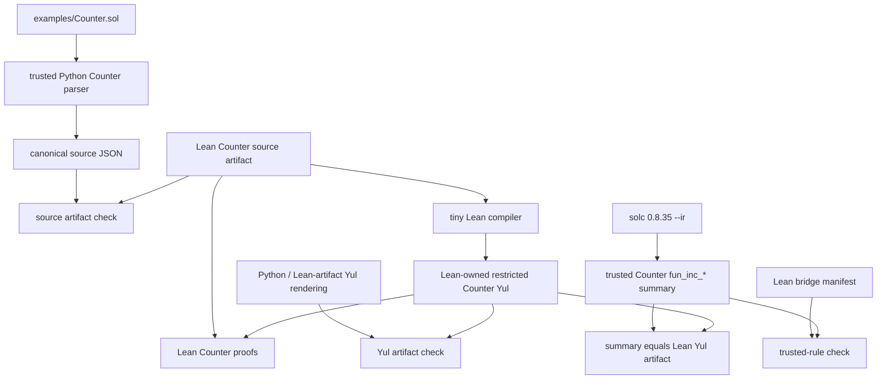

# Counter Research Demo

This is the current presentation-grade Counter demo for SoLean. It is designed
to show a real Lean-proved core and an auditable bridge to pinned `solc`
output, without claiming full Solidity verification or real Yul equivalence.

## One-Command Demo

Run:

```bash
python3 scripts/demo_counter_bridge.py
```

The demo runs:

- `lake build`
- bridge-focused Python tests
- Lean artifact export smoke checks for `source-json`, `yul-json`, and
  `bridge-json`
- the Counter bridge report in Markdown mode if `build/Counter.solc.yul`
  exists

If local solc IR is missing, the demo skips only the real-solc boundary and
prints the exact generation command:

```bash
python3 scripts/solc_to_yul.py examples/Counter.sol -o build/Counter.solc.yul
```

## Architecture



## Current Claims

The demo supports this claim:

```text
For Counter, the Lean-owned source and restricted Yul artifacts are proved
inside Lean, and the Solidity parser, Python/Lean-artifact Yul rendering, and
trusted solc function summary all align with those Lean-owned artifacts.
```

The current Counter bridge rules now have Lean-backed semantic models for every
semantic helper rewrite except hex-literal parsing:

- `cleanupUint256AsIdentity`
- `convertRationalZeroByOneToUint256AsIdentity`
- `requireHelperAsRevertGuard`
- `storageReadSlot0AsSload`
- `checkedAddUInt256AsAddWithOverflowGuard`
- `storageUpdateSlot0AsSstore`
- `assertHelperAsRevertGuard`

The exact proof names are exported in the Lean-owned `bridge-json` manifest.

## Non-Claims

The demo does not claim:

- verified Solidity parsing
- verified Python solc-IR parsing
- full Yul or EVM semantics
- semantic equivalence between real `solc` Yul and SoLean-generated Yul
- SimpleVault compilation to Yul
- support for ABI decoding, memory, calls, gas, events, reentrancy, or contract
  creation

The most important non-claim is:

```text
Yul_1 = real solc output
Yul_2 = SoLean output
Lean proves Yul_1 ≈ Yul_2
```

That is not implemented yet.

## Remaining Trusted Rules

These Counter solc summary rules are still trusted Python pattern recognition:

- `hexLiteralAsNat`

The transparent helper bundle from Bridge v2 has been split into concrete rule
names. The next question is whether `hexLiteralAsNat` should remain explicit
parser-level trust or become a tiny checked literal-parser path.

## Useful Commands

Render the Counter Yul from the Lean-owned artifact:

```bash
python3 scripts/solean_to_yul.py --example counter --source lean-artifact
```

Run the bridge report as Markdown:

```bash
python3 scripts/check_counter_bridge.py \
  --format markdown \
  --solidity examples/Counter.sol \
  --solc-yul build/Counter.solc.yul
```

Export the Lean bridge manifest:

```bash
lake env lean --run SoLean/CounterArtifactsMain.lean bridge-json
```
